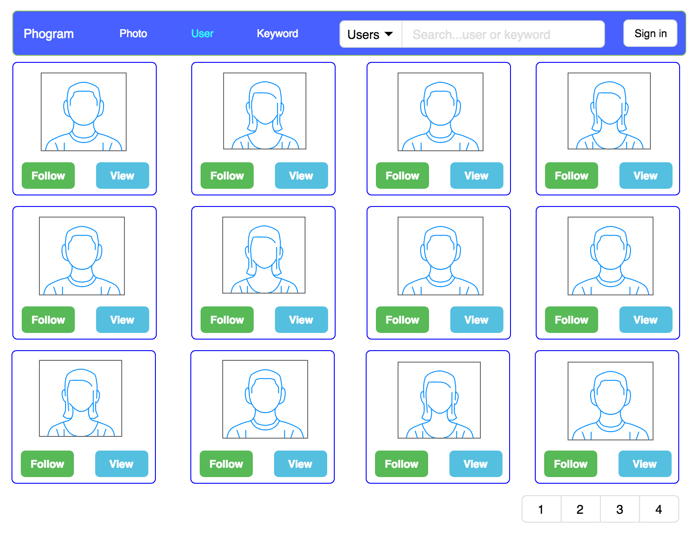

## phogram

#### Conceptual
* photo

* user

* keyword

* login/register


#### Back-End Structure


#### Database


### Usage
```
+ USER
    - register
        POST:localhost:8080/user/register 
        RequestBody{
            {
            	"firstName":"test2",
            	"lastName":"Kim",
            	"username":"test2",
            	"email":"test2@test.com",
            	"phone":"010-3922-3039",
            	"password":"test2"
            }
        }
        Response{
            String:message
        }
        
    - login
         POST:localhost:8080/user/login
         RequestBody{
            "username":"test2",
            "passsword":"test2"
         }
         ResponseBody{
            String:token
         }
    - get user info
         GET:localhost:8080/api/v1/user
             Header:{Content-Type:application/json,Authorization:PG-Auth receivedToken}
         ResponseBody{
            "username": "test1",
            "password": "$2a$10$ZycgXllK4hFSsbaA5vq3wueifXdDtFwIqvN35Xf333qWKDKGu7OGq",
            "email": "test1@example.com"
            "phone":"010-2812-2933",
            ...
         }
    - update user info
         PUT:localhost:8080/rest/user
             Header:{Content-Type:application/json,Authorization:PG-Auth receivedToken}
         RequestBody{
            "username": "test1", --> can't change username
            "password": "changepassword",
            "email": "changeEmail@example.com"
            ...
         }
         Response{
            Stirng : message
         }
    - delete user info
         DELETE:localhost:8080/rest/user
             Header:{Content-Type:application/json,Authorization:PG-Auth receivedToken}
         Response{
            Stirng : message
         }
```
